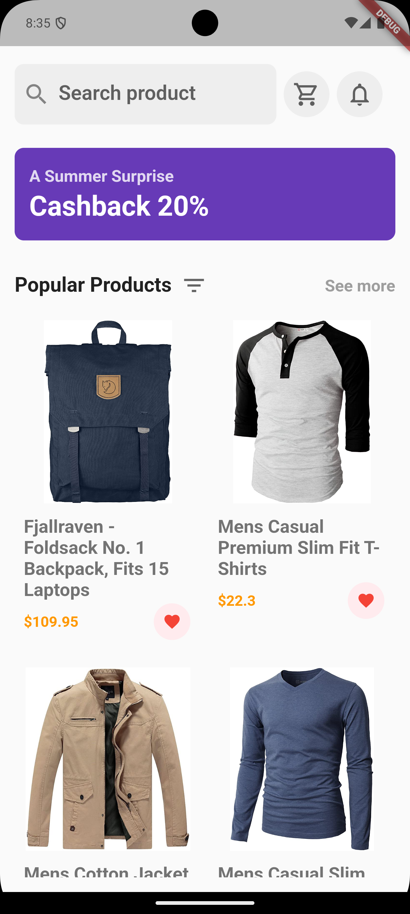

# Flutter E-commerce App

## Overview

This Flutter application recreates an e-commerce shop's home page UI, integrating real product data from [FakeStore API](https://fakestoreapi.com/products). The app includes skeleton loading screens, error handling, pagination, and filtering functionality.

## Features

### 1. UI Implementation

- Recreates the provided UI design accurately.
- Displays a product grid with images, titles, and prices.
- Includes a search bar for filtering products.

### 2. API Integration

- Fetches product data from [FakeStore API](https://fakestoreapi.com/products).
- Supports filtering products by name.

### 3. Skeleton Loading Screen

- Implements a skeleton loader for the product grid until data is loaded.

### 4. Additional Features

- **Pull-to-Refresh**: Users can refresh the product list.
- **Error Handling**: Displays an error message and provides a retry option.
- **Category Filtering**: Users can filter products by category.

## App Screenshot



## Installation & Setup

1. **Clone the repository:**
   ```sh
   git clone https://github.com/animeshagarwal96/Ecom.git
   cd ecom
   ```
2. **Install dependencies:**
   ```sh
   flutter pub get
   ```
3. **Run the application:**
   ```sh
   flutter run
   ```

## Technologies Used

- **State Management:** Bloc (flutter\_bloc)
- **Networking:** HTTP Package (http)
- **UI Enhancements:** Shimmer effect for skeleton loaders
- **Error Handling:** Try-catch and Network check using connectivity plugin

## Challenges Faced

- Handling real-time API failures and managing state updates smoothly.
- Implementing a dynamic product grid with efficient pagination.
- Ensuring smooth UI performance with large data sets.

## Assumptions & Notes

- The app uses a fake store API, which might have some limitations in product availability.
- The UI is designed to be responsive but may need additional adjustments for tablets.

## Future Enhancements

- **Animations**: Adding micro-interactions to enhance user experience.
- **Offline Mode**: Caching product data for better performance.
- **Enhanced Filtering**: Multi-filter options based on Category.

## Submission Details

- **Repository:** [GitHub Repo](https://github.com/animeshagarwal96/Ecom.git)
- **APK Download:** [APK Link](https://fileport.io/3VR2nzzh8qVA)

## Author

- **Name:** Animesh Agarwal
- **Email:** animeshagarwal19@gmail.com

